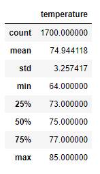
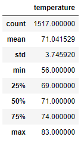

# Surfs Up Analysis
## Overview
The purpose of this analysis was to discover temperature trends in Oahu for W. Avy, so he can determine if a surf and ice cream shop will be sustainable year-round.
## Results
* June
  * Mean: 74.94
  * Min: 74.94
  * Max: 85.00
  

  
* December
  * Mean: 71.04
  * Min: 56.00
  * Max: 83.00

## Summary
From looking at the data I think it is definitely a good idea for W. Avy to open up a surf shop. The mean temperatures for both months are definitely in the range to make surfing viable. Even though the min is 56 for December, which would not attract many surfers, at 25% the temperature is 69 which is definitely comfortable surfing weather. When we look at precipitation the mean for June and December is 0.14 and 0.22 inches per day respectively, and at 50% its at .02 and .03 respectively so that indicates it doesn’t rain very often.
Along with the data we already have prepared we could perform an additional query to determine what the best location on the island would be for the surf shop. We could also perform a query to determine how big the waves are at different points in the year.
